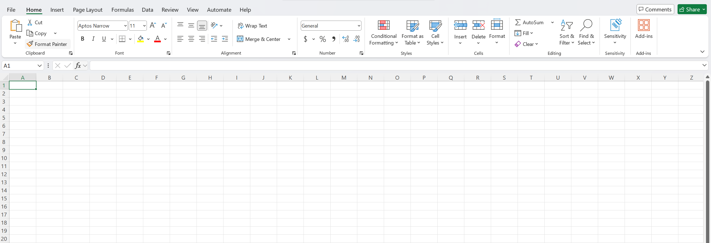

# 01 — Introduction to Excel for Data Analytics

**Navigation:** [Notes Index](README.md) | Next → [02 — Entering & Organizing Data](02-entering-and-organizing-data.md)
**Exercise:** [Exercise 01](../02-exercises/01-introduction-to-excel-exe.md)

---

## What is Microsoft Excel?

Excel is a **spreadsheet** program. A spreadsheet is a grid of cells arranged in rows and columns where you store data, perform calculations, and build reports. Excel was first released in 1985 and is today the most widely used tool in the world for working with structured data.

For data analytics specifically, Excel lets you:

- Store and organize tables of data (sales, survey responses, inventory, experiments)
- Calculate totals, averages, growth rates, and other metrics with **formulas**
- Find, filter, and sort records to answer questions
- Summarize thousands of rows in seconds with **PivotTables**
- Turn numbers into **charts** and **dashboards** that tell a story

You do not need to be a programmer. Excel is point-and-click, and the small amount of "code" you write (formulas) is readable plain text.

---

## Why Excel for Data Analytics?

- It is everywhere — almost every company uses it, so the skill is immediately employable.
- It has a gentle learning curve compared with code-based tools like Python or R.
- It is excellent for small-to-medium datasets (up to roughly a million rows).
- It connects to many data sources (CSV, databases, the web) through **Power Query**.
- The concepts you learn here — tables, joins (lookups), aggregation, filtering — transfer directly to SQL, Python/pandas, and BI tools like Power BI.

> **When *not* to use Excel:** for datasets of many millions of rows, automated production pipelines, or heavy statistical modeling, dedicated tools (databases, Python, R) are better. Excel is for exploration, reporting, and analysis at human scale.

---

## The Excel Interface

When you open Excel and create a **Blank workbook**, you see something like this:



*The Excel window: the **Ribbon** (with the **Home** tab open) runs across the top; just below it the **Name Box** (showing `A1`) sits to the left of the **Formula Bar** (marked `fx`); and the grid fills the rest, with **column letters** (A, B, C…) across the top and **row numbers** (1, 2, 3…) down the side.*

The diagram below labels the same parts schematically:

```
┌─────────────────────────────────────────────────────────────┐
│  File   Home  Insert  Page  Formulas  Data  Review  View     │ ← Ribbon tabs
├─────────────────────────────────────────────────────────────┤
│  [Paste] [B I U] [Align] [Number ▾] [Conditional Fmt] ...    │ ← Ribbon
├──────────┬──────────────────────────────────────────────────┤
│  Name Box│  fx  =                                            │ ← Formula bar
├──────────┼─────┬─────┬─────┬─────┬─────┬─────────────────────┤
│          │  A  │  B  │  C  │  D  │  E  │                     │ ← Column headers
├──────────┼─────┼─────┼─────┼─────┼─────┤                     │
│     1    │     │     │     │     │     │                     │
│     2    │     │     │     │     │     │                     │ ← Cells (the grid)
│     3    │     │     │     │     │     │                     │
├──────────┴─────┴─────┴─────┴─────┴─────┴─────────────────────┤
│  ◄ ► │ Sheet1 │ +                                            │ ← Sheet tabs
└─────────────────────────────────────────────────────────────┘
```

Key parts to know by name:

- **Ribbon** — the toolbar at the top, organized into **tabs** (Home, Insert, Data, …). Each tab holds related buttons grouped into sections. For analytics you will live mostly in **Home**, **Insert**, **Formulas**, and **Data**.
- **Name Box** — the small box on the left of the formula bar. It shows the address of the selected cell (e.g. `A1`) and lets you jump to a cell or named range by typing into it.
- **Formula Bar** — shows and lets you edit the content of the selected cell. If a cell shows a calculated number, the formula bar reveals the formula behind it.
- **Cell** — a single box in the grid, identified by its column letter and row number (e.g. `B3` is column B, row 3). The selected cell is the **active cell**.
- **Sheet tabs** — at the bottom. One workbook can hold many **worksheets** (sheets).

---

## Workbooks, Worksheets, and Cells

These three words describe the hierarchy of an Excel file:

- **Workbook** — the whole file (a `.xlsx` file). When you save, you save a workbook.
- **Worksheet** (or **sheet**) — one tabbed page of the grid inside a workbook. A workbook can have one sheet or dozens. Use separate sheets to keep raw data, calculations, and reports apart.
- **Cell** — one box in a worksheet's grid, the smallest unit. A **range** is a rectangular block of cells (e.g. `A1:C10`).

A cell address combines the column letter and row number:

| Address | Meaning |
|---------|---------|
| `A1` | Column A, Row 1 (top-left cell) |
| `C5` | Column C, Row 5 |
| `A1:A10` | A range: cells A1 through A10 (one column, ten rows) |
| `A1:C3` | A range: a 3×3 block |

> **Tip:** To add a new sheet, click the `+` next to the sheet tabs. Double-click a sheet tab to rename it. Right-click a tab to color it, move it, or delete it. Good naming (`RawData`, `Summary`, `Dashboard`) keeps a workbook organized.

---

## Data Types: What Lives Inside a Cell

Every cell holds one of a few kinds of value. Knowing which one matters because calculations only work on the right type.

| Type | Examples | How Excel aligns it by default |
|------|----------|-------------------------------|
| **Number** | `42`, `3.14`, `-7`, `1500` | Right-aligned |
| **Text** (a.k.a. string) | `Apple`, `North Region`, `N/A` | Left-aligned |
| **Date / Time** | `2026-06-29`, `14:30` | Right-aligned (dates are secretly numbers — see Note 07) |
| **Boolean** | `TRUE`, `FALSE` | Centered |
| **Formula** | `=A1+B1` | Shows the *result*; the formula is in the formula bar |
| **Error** | `#DIV/0!`, `#N/A` | A formula that couldn't compute |

**A crucial habit:** the alignment is a free hint. If you type a number and it appears on the **left**, Excel is treating it as text — and text won't add up. This is one of the most common beginner bugs, and we will fix it properly in Note 09 (Data Cleaning).

---

## Your First Spreadsheet

Let's build a tiny table. Type the following, pressing **Tab** to move right and **Enter** to move to the next row.

| | A | B | C |
|--|--------|--------|---------|
|**1**| Product | Units | Price |
|**2**| Apples | 50 | 0.30 |
|**3**| Bananas | 30 | 0.25 |
|**4**| Cherries | 20 | 1.10 |

Now, in cell **D1**, type `Revenue`. In **D2**, type a formula:

```
=B2*C2
```

Press Enter. Cell D2 shows `15` (50 × 0.30). You just wrote your first formula. Notice:

- A formula **always begins with `=`**. That sign tells Excel "compute this, don't store it as text".
- `B2` and `C2` are **cell references** — they pull the live values from those cells. If you change B2, D2 updates automatically.
- `*` means multiply. The basic operators are `+ - * /`.

In Note 03 you'll learn to copy that one formula down the whole column in a single drag.

---

## Selecting and Navigating

Speed in Excel comes from the keyboard. The essentials:

| Action | How |
|--------|-----|
| Move one cell | Arrow keys |
| Jump to the edge of a data block | `Ctrl + Arrow` |
| Select a range | Click and drag, or hold `Shift` + Arrow |
| Select a whole column / row | Click the column letter / row number |
| Select the entire used data block | Click inside it, press `Ctrl + A` |
| Go to a specific cell | Type its address in the **Name Box** and press Enter |
| Edit the active cell | Press `F2` (or double-click) |

> **Try `Ctrl + Arrow`:** with the active cell inside your little table, press `Ctrl + ↓`. The selection jumps to the last filled cell in the column. On a 10,000-row dataset this is how you reach the bottom instantly instead of scrolling.

---

## Saving Your Work

- **`.xlsx`** is the standard Excel format. Use it unless you have a reason not to.
- **`.xlsm`** is needed only if your workbook contains macros (VBA code).
- **`.csv`** (comma-separated values) is a plain-text format with *no formulas, formatting, or multiple sheets* — just raw values. CSV is the universal exchange format between Excel and other tools (databases, Python, web apps). You will import CSVs constantly in analytics.

Save with `Ctrl + S`. Save early, save often.

> **Important:** Saving an `.xlsx` workbook as `.csv` throws away everything except the values on the active sheet — formulas become their last-calculated results, formatting is lost, and only one sheet survives. Keep an `.xlsx` master copy; export to CSV only when you need to hand data to another tool.

---

## Key Things to Remember

> **Formulas start with `=`.**
> Without the equals sign, Excel stores your text literally instead of calculating it.

> **Alignment reveals the data type.**
> Numbers and dates align right; text aligns left. A "number" sitting on the left side of its cell is really text and will not calculate.

> **Excel is for tabular data.**
> Keep your data as a clean table: one row per record, one column per attribute, a single header row on top, and no blank rows in the middle. Almost every analytics feature (sorting, filtering, PivotTables) assumes this layout.

> **Separate raw data from analysis.**
> Put untouched source data on one sheet and your calculations/reports on others. Never type over your raw data — you'll want it again.

---

**Navigation:** [Notes Index](README.md) | Next → [02 — Entering & Organizing Data](02-entering-and-organizing-data.md)
**Exercise:** [Exercise 01](../02-exercises/01-introduction-to-excel-exe.md)
