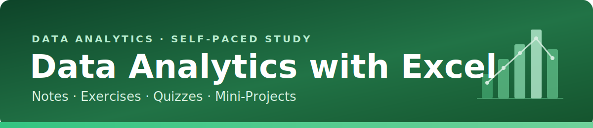

# 📊 01 Notes

[Home](../index.md) &nbsp;|&nbsp; [Exercises](../02-exercises/README.md) &nbsp;|&nbsp; [Quiz Hub](../03-quiz/) &nbsp;|&nbsp; [Projects](../04-projects/README.md) &nbsp;|&nbsp; [Resources](../05-resources/README.md)

Topic-by-topic notes on using Microsoft Excel for data analytics, from absolute basics to dashboards and What-If analysis. Each note stands alone and links to its matching exercise.

## 🧭 Chapter Index

| # | Topic | Note | Practice |
| --- | --- | --- | --- |
| 01 | Introduction to Excel for Data Analytics | [Read](01-introduction-to-excel.md) | [Exercise](../02-exercises/01-introduction-to-excel-exe.md) |
| 02 | Entering & Organizing Data | [Read](02-entering-and-organizing-data.md) | [Exercise](../02-exercises/02-entering-and-organizing-data-exe.md) |
| 03 | Formulas & Cell References | [Read](03-formulas-and-cell-references.md) | [Exercise](../02-exercises/03-formulas-and-cell-references-exe.md) |
| 04 | Essential Functions (Count, Sum & Statistical) | [Read](04-essential-functions.md) | [Exercise](../02-exercises/04-essential-functions-exe.md) |
| 05 | Logical Functions | [Read](05-logical-functions.md) | [Exercise](../02-exercises/05-logical-functions-exe.md) |
| 06 | Text Functions | [Read](06-text-functions.md) | [Exercise](../02-exercises/06-text-functions-exe.md) |
| 07 | Date & Time Functions | [Read](07-date-and-time-functions.md) | [Exercise](../02-exercises/07-date-and-time-functions-exe.md) |
| 08 | Lookup & Reference Functions | [Read](08-lookup-and-reference-functions.md) | [Exercise](../02-exercises/08-lookup-and-reference-functions-exe.md) |
| 09 | Data Cleaning & Validation | [Read](09-data-cleaning-and-validation.md) | [Exercise](../02-exercises/09-data-cleaning-and-validation-exe.md) |
| 10 | Sorting, Filtering & Conditional Formatting | [Read](10-sorting-filtering-conditional-formatting.md) | [Exercise](../02-exercises/10-sorting-filtering-conditional-formatting-exe.md) |
| 11 | PivotTables & PivotCharts | [Read](11-pivottables-and-pivotcharts.md) | [Exercise](../02-exercises/11-pivottables-and-pivotcharts-exe.md) |
| 12 | Charts, Dashboards & What-If Analysis | [Read](12-charts-dashboards-what-if.md) | [Exercise](../02-exercises/12-charts-dashboards-what-if-exe.md) |

## 🗺️ Recommended Flow

1. Read the chapter note.
2. Complete the matching [exercise](../02-exercises/README.md).
3. Test recall in the [Quiz Hub](../03-quiz/) (25 random questions per attempt).
4. Apply it in a [project](../04-projects/README.md).

[Back to repository home](../index.md)

